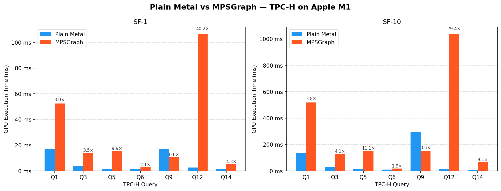

# GPU-DB-MPS-benchmark

All 22 TPC-H queries implemented with Apple MPSGraph, benchmarked against a hand-written Metal baseline. No custom `.metal` kernels.

## Latest Benchmark Results

**System**: Apple M1, 8 GPU cores
**Methodology**: 2 warm-up runs discarded, GPU execution time only, SF-1 and SF-10

| | |
|---|---|
| MPSGraph slower | 35 / 44 combinations |
| Geometric mean | 3.86× |
| Worst case | 79.4× (Q12, SF-10) |
| MPSGraph faster | 9 combinations, best 13.4× (Q13, SF-10) |



Per-query results: `results/comparison_table.csv`

## Prerequisites

- Apple Silicon Mac with Xcode Command Line Tools
- TPC-H data from `dbgen` in `data/SF-1/` and `data/SF-10/` (not included)
- Python 3 with `pandas`, `matplotlib`, `numpy` — for `compare.py` only

## Quick Start

```sh
# 1. Build
make

# 2. Run all queries
./GPUDBMPSBenchmark sf1
./GPUDBMPSBenchmark sf10

# 3. Compare against the Metal baseline
MPLBACKEND=Agg python3 compare.py
```

## Manual Execution

```sh
./GPUDBMPSBenchmark sf1 q6     # single query
./GPUDBMPSBenchmark micro      # micro-benchmarks
./GPUDBMPSBenchmark help       # all options
```

## Structure

```
src/         one .mm per query (q1-q22), plus main.mm and mps_infra.{h,mm}
results/     benchmark CSVs, comparison table and chart
compare.py   joins both result CSVs, writes the comparison table and chart
```

## Benchmark Details

- **Output**: one CSV row per run — `timestamp, scale_factor, query, gpu_exec_ms, cpu_post_ms, total_exec_ms, gpu_name, memory_gb`
- **Timing**: `gpu_exec_ms` covers command-buffer commit to completion; CPU-side work is logged separately as `cpu_post_ms`
- **Metal baseline**: [nd-tung/GPUDBMetalBenchmark](https://github.com/nd-tung/GPUDBMetalBenchmark) at commit `f0069d5`, used unmodified. Run it against the same `data/` directories to populate `results/metal_results.csv`.

